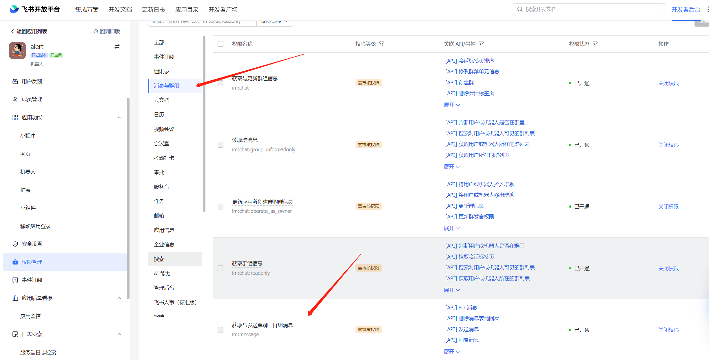
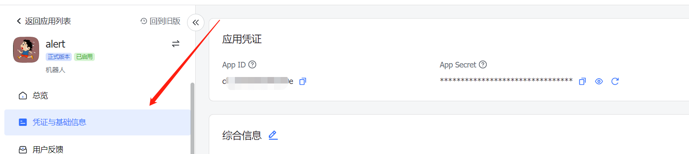
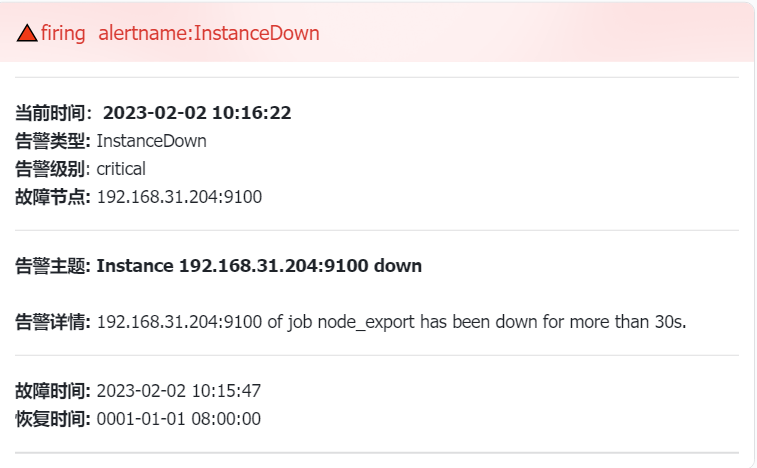
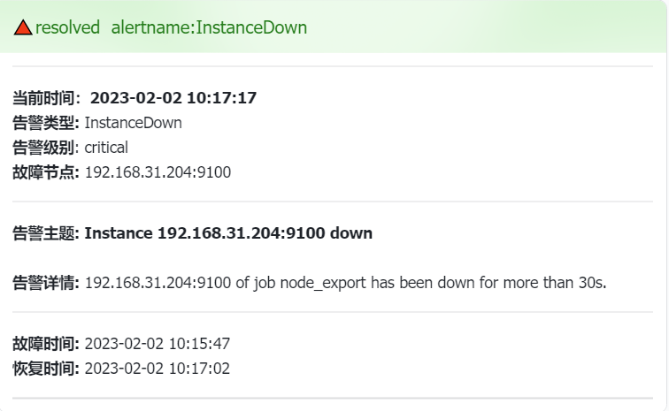

# prometheus 告警 通知到飞书 的一个程序 feishu

## 简介

feishu 是一款将alertmanager 的告警消息通过webhook发送到飞书群里，它是一款将promethus-alertmanager告警通知转发到飞书的中转程序。

## 快速开始

前提条件：此代码用go语言编写，需要安装go环境

拉下代码后执行：

```shell
make alpine
```

二进制文件位置在目录/example/alterwebhook/ 下

然后设置环境变量AppID 和 Secret。这两个环境变量需要在你自己的飞书开发平台获取。如何获取见下文

```shell
export AppID=***
export Secret=***
```

最后启动程序：监听的端口为5001

```shell
./feishu
```

## 飞书配置

进入飞书开放平台，在开发者后台中创建一个机器人，然后进入机器人页面里设置api访问权限，将发送群的一些权限都开启：

比如：获取与发送单聊、群主消息



查看自己的AppID 和 Secret



最后：

在飞书app中创建一个自己的通知告警的群，再这个群中添加你自己创建的机器人，飞书配置就已完成。

## prometheus-alertmanager 配置

feishu 程序有两种模式发送到你创建的群中(这里所说的群指机器人所在的群)。

第一种是最初的版本方式，适用于将所有告警只发送到一个群。它的webhook地址形式为：http://example.com:5001/

这种地址形式始终将消息发送到第一个群，也就是数组下标为0的这个群，我们可以通过: http://example.com:5001/test 查看第一个群是谁

第二种方式就是将告警发送到指定的群中，如果你的飞书创建了多个群这个方式非常有用。他的webhook地址形式为: http://example.com:5001/cluster/youname

你需要将youname 替换为自己飞书上的群名字，比如：http://localhost:5001/cluster/测试环境告警群

如果将youname 替换为all 将会将告警发送到所有群(这里所说的群指机器人所在的群)，比如：http://localhost:5001/cluster/all

这种形式结合alertmanager就可以实现将告警分组，把不同的项目或者组的告警发送到不同的群中，比如：

```yaml
route:
  group_by: ['alertname']
  group_wait: 30s
  group_interval: 1h
  repeat_interval: 8h
  receiver: 'feishu'
  routes:
  - receiver: 'test'
    matchers:
    - env="test"
receivers:
  - name: 'feishu'
    webhook_configs:
      - url: 'http://localhost:5001/'
        send_resolved: true
  - name: 'test'
    webhook_configs:
      - url: 'http://localhost:5001/cluster/测试环境告警群'
  - name: 'all'
    webhook_configs:
      - url: 'http://localhost:5001/cluster/all'
inhibit_rules:
  - source_match:
      severity: 'critical'
    target_match:
      severity: 'warning'
    equal: ['alertname', 'dev', 'instance']

```

他会将标签为 env="test" 的告警发送到 '测试环境告警群' 的群中。

## docker 快速启动

```shell
docker run --name feishu -d -p 5001:5001 -e AppID=*** -e Secret=*** --restart=always xianhuaihai/feishu-alpine
```

将AppID和Secret 替换为自己的值

## 效果图





## 其它

[项目源地址](https://gitee.com/xianhuaihai/alter)：https://gitee.com/xianhuaihai/alter
